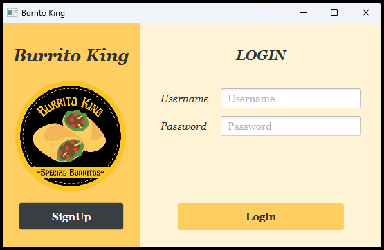

# Food Ordering Application

Checkout other screens inside `images` folder!

## Overview 
An updated version of the previous project called Burrito King, now featuring:
- A colorful and intuitive graphical user interface (GUI) for enhanced user experience.
- A VIP system with a points-based rewards program. Points can be redeemed for free food or discounts.
- Profile management options for users.
- A robust database storing information related to registered users.

## Features (simplified)
1. __Intuitive GUI__: Navigate and place orders effortlessly with a visually appealing design.
2. __VIP Points System__:
   - Earn points on orders and redeem them for free food.
   - Points are only deducted after the successful collection of orders.
3. __User Profiles__:
   - Update and manage personal details securely.
4. __Database Integration__:
   - Stores user information, order history, and transaction records.
   - Facilitates efficient and reliable data management.
5. __Export to CSV__:
   - Export selected past orders to a CSV file with selected information.

----

<H2>Program Specifications</H2>
Program IDE : IntelliJ IDEA 2023.3.4 (Ultimate Edition)

Java Version : 21.0.2

JavaFX Version : 21

JavaFX Runtime Version : 21+31

JUnit Version : 5.10.0

Database : SQLite

<h2>Install and Running the Application</h2>

1. From the Github Repository, click the "Code" button and copy the HTTPS link: https://github.com/AdvancedPrograming/assignment2-anneelv.git
2. In your terminal, open the folder where you want to clone the folder
3. After opening the target folder, run the following code:\
`git clone https://github.com/anneelv/restaurant-local-app.git .`\
The `.` at the end indicates that the project will be cloned on that folder
4. After cloning done, open `BurritoKingV2` folder in IntelliJ (Since the program is developed in Intellij environment)
5. On the folder name, right click and select `Open Module Setting`
6. Under the `Libraries`, add the following two libraries with `From Maven`:
    * Keyword: `slf4j`, look for the following package: `com.googlecode.slf4j.maven.plugin.log:slf4j-maven-plugin-log:1.0.0`. The package should be the first result of searching.
    * Keyword: `jdbc sqlite`, look for the following package: `org.ops4j.pax.jdbc.sqlite:pax-jdbc-sqlite:1.5.3`. The package is around middle area after `io.streamnative` packages
7. After that click the `Apply` button and then `OK` button
8. Navigate to `Main.java` file and run that file (Make sure that it is not running the Test files)

----

Assumptions:
1. Foods that are not yet finalized will be gone if the user logs out. However, it will be retained if the user just change between menu during the session.
2. Remaining fries are reset whenever the application is closed. As long as the application is running, even if users are changed, the remaining fries will be retained.
3. Whenever order are placed, the order will automatically have "Await for Collection" status. However, when user wants to pickup the order they must take note of the waiting time of the order. The order can't be collected when it is not yet past it's waiting (preparation) time.
4. Whenever a VIP User wants to pay for the order using their points, the points  will not be deducted until that order is collected. This is because there is still a chance for that order to be cancelled.
5. Points collection for VIP User will be working only for Orders that are already collected.

<H2>Application Design</H2>

Database Tables:
- Customer : holds customer private information
- Food_Item : holds food information that are sold in the application 
- Order : holds each order transactions that happened in the application. All order recorded is only for finalized order. Meaning that order that have already gone through payment session.
- Order_Item : intermediary between Food_Item and Order. It holds the item and its quantity that gets ordered in each transaction.

----

Database Java Classes:
- DatabaseConnection : establishing connection through JDBC to SQLite.
- DatabaseInit : Intitialize the database, tables, and also the content of Food_Item database. The class will create an instance of each "Db" classes and call the method to setup the tables. It will also check for the existence of each tables.
- DbSkeleton : The backbone of each "Db" classes. It is an abstract class. It consist of setting up the table and checking whether the table exist or not.
- CustomerDb : A class that is responsible for Customer table. 
- OrdersDb : A class that is responsible for Order table.
- Food_ItemDb : A class that is responsible for Food_Item table.
- Order_ItemDb : A class that is responsible for Order_Item table.

Notes:
- Each "Db" class controls one table in the database with the same name. Except for <b>OrdersDb</b>, because it will have access to Order_Item table to retrieve the corresponding items in each transaction, and <b>Order_ItemDb</b>, because it will have access to Food_Item table to retrieve related food information
- Every "Db" classes depends on DatabaseConnection class to establish connection with the database
- DbSkeleton is the parent class of CustomerDb, OrdersDb, Food_ItemDb, and Order_ItemDb
- DatabaseInit will be called once the program is started from the Main file

----

Java Controller Classes (each Scene is connected to its corresponding Controllers with the same name):
- ControllerInit : An abstract class as a backbone for controllers that need to initialize UserSession and UI.
- SwitchSceneController : A class to handles all methods to navigate between scenes.
- SignupController : A class to handle Signup Scene. User will be registered to the database and able to log in by using the registered information.
- LoginController : A class to handle Login Scene. This is the first scene to be shown when the program is launched.
- DashboardController : A class to handle Dashboard Scene. Since the scene utilizes Navigation Panel, it will stay through out the session until the user logs out. It will manage the change of scene for the menu options available in the panel. 
- OrderController : A class to handle Order Scene. It will be called together when DashboardController first initiated. It will take care of showing Ongoing Orders (Order that is not yet cancelled or collected) and also Past Orders. It will also takes care food collection, food cancellation, and also exporting food history.
- ProfileController : A class to handle Profile Scene. It will take care of any changes in the user information including upgrading the current account to VIP. Any change to the name will be automatically reflected in the Dashboard.
- FoodMenuController : A class to handle FoodMenu Scene. It shows the foods that are available for orders. The Meal will be disabled for any non-VIP user. Number of foods ordered will be retained as long as the order is not yet checked out.
- UpgradeVIPController : A class to handle UpgradeVIP Scene. It ensures that the user input a valid email address for proceed to upgrade their account. After upgrade process, the user are required to login again.
- CheckoutController: A class to handle Checkout Scene. It summarizes the foods that the user order. It shows the total prices and waiting time for the amount of food ordered. Users still able to go back to the Dashboard from this point. However, if the user choose to Checkout, it will ask for confirmation before going to the Payment (FinalizingOrder) Scene.
- FinalizingOrderController : A class to handle FinalizingOrder Scene. It handles the payment of the order and also takes care of the order placed time. For VIP Users, another prompt will be shown to ask if they want to redeem their points. For normal users, after validating their input the order will be recorded in the database and they will be redirected to the Dashboard again.
- CollectOrderController : A class to handle CollectOrder Scene. It will ask user to input collection time to validate the pickup time. Pickup time must be after the placed time + waiting time of the order.
- PointHistoryController : A class to handle PointHistory. It will show every transactions that are completed. It shows how much points are gained from each transaction but also shows how many points are used for that completed order.
- PointRedemptionController : A class to handle PointRedemption Scene. It is shown after the user confirms to use their point for the current order. It will validate the number of points to be used and show the total price left after points redemption.
- Validator : A class to handle several input validation such as time, card number, card expiry date, and several more.
- MultilineCellFactory : A class to enable columns in table view to hold several values in a new line but still within the same row.
- UserSessionListener (Interface) : An interface to enable classes that implements this interface to simultaneously updates upon the trigger by updating User information.

Notes:
- There are 12 FXML files that are connected with each controllers
- Point History Scene are hidden from normal users and will be shown to only "VIP" users.
- The label to upgrade the account to VIP will also be hidden once the user is a "VIP"

----

Java Models Classes:
- UserSession : A class that holds the current logged in user information. From user profile information, active orders (order that are yet finalized), and also past/finalized orders. It also keep tracks
- Customer : A class to manage user's profile information.
- Order : A class to manage user's order that are not yet finalized.
- FinalizedOrder : A subclass of Order. Manage orders that are already go through payment and finalized.
- FoodItem : A class to manage all food items that are sold in the application.
- Burrito : A subclass of FoodItem and implements Cookable. A class of Burrito.
- Fries : A subclass of FoodItem and implements Cookable. A class of Fries.
- Soda : A subclass of FoodItem. A class of Soda.
- Meal : A subclass of FoodItem. A class of Meal.
- Cookable (Interface) : An interface that helps calculate cooking time for classes that implements this interface.

Notes:
- Cookable is implemented by Burrito and Fries because they need to be prepared for a few minutes before served. Meal does not implement this interface because it is part of both Burrito and Fries.
